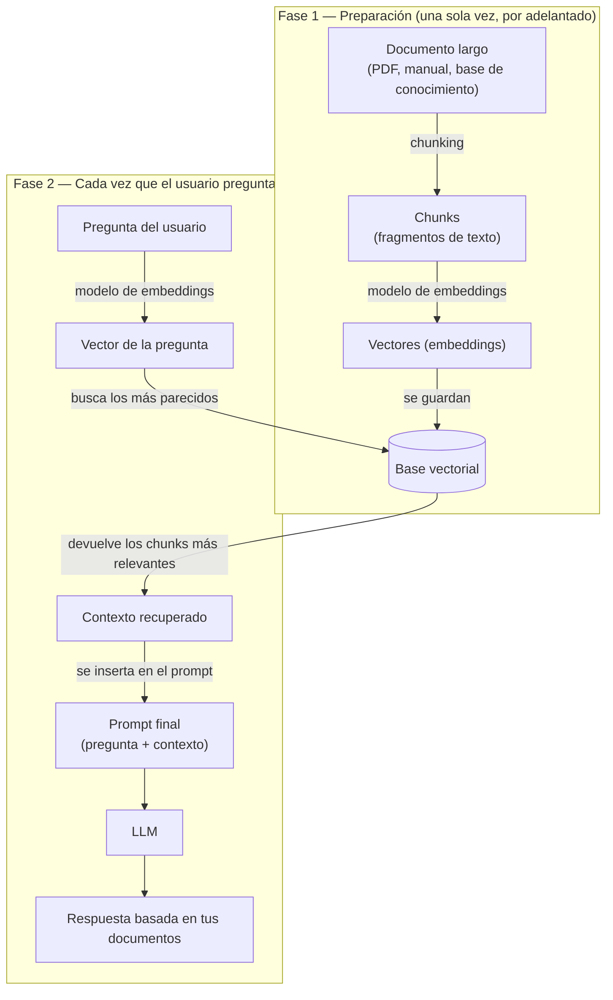

# Conceptos básicos: LLMs, LangChain y las piezas que no se ven

Este documento es un complemento de [`README.md`](./README.md). Ahí se explica *la arquitectura* del proyecto; acá se explican **los conceptos de base** que hacen falta para entenderla: qué es un LLM, qué es un token, qué es un chunk, qué es una base vectorial, qué es un `PromptTemplate`, y — sobre todo — **qué devuelve cada clase cuando la invocás**, porque eso es lo que más confunde al empezar con LangChain.

No hace falta leer esto en orden estricto, pero está pensado para leerse de arriba hacia abajo la primera vez.

---

## 1. ¿Qué es un LLM, en el fondo?

Un **LLM** (*Large Language Model*, modelo de lenguaje grande) es, en su núcleo, una máquina de una sola tarea: **dado un texto, predecir cuál es la palabra (o fragmento de palabra) más probable que sigue**.

No "entiende" ni "razona" en el sentido humano. Es más parecido a un autocompletado extremadamente sofisticado, entrenado con enormes cantidades de texto, que aprendió patrones estadísticos del lenguaje: qué palabras suelen seguir a otras, en qué contexto, con qué estilo.

Cuando le pedís "Explicame qué es Python", el modelo no busca una respuesta guardada en algún lado. Genera la respuesta **palabra por palabra** (más precisamente, *token por token* — ver abajo), donde cada nueva pieza se elige en base a todo el texto generado hasta ese momento.

```
Prompt: "El clima en Buenos Aires es"
Modelo genera, un paso a la vez:
  "templado"  → "El clima en Buenos Aires es templado"
  " y"        → "El clima en Buenos Aires es templado y"
  " húmedo"   → "El clima en Buenos Aires es templado y húmedo"
  ...
```

Esto es clave para entender el **streaming** más adelante: si el modelo genera de a pedazos, tiene sentido que la aplicación pueda *mostrar* esos pedazos a medida que se generan, en vez de esperar a que termine todo.

### Tokens: la unidad real que procesa el modelo

Un **token** no es exactamente una palabra. Es la unidad mínima de texto que el modelo procesa — puede ser una palabra completa, un pedazo de palabra, un signo de puntuación, o incluso un espacio. Por ejemplo, `"conversación"` puede partirse en algo como `conversa` + `ción`, dependiendo del *tokenizer* de cada modelo.

Por qué importa esto en la práctica:

- Los proveedores de LLM (Google, OpenAI, etc.) **cobran y limitan por tokens**, no por caracteres ni por palabras.
- Cada modelo tiene un **límite de contexto** (cuántos tokens puede "ver" a la vez, sumando prompt + historial + respuesta). Por eso en este proyecto el historial de la conversación no puede crecer para siempre sin límite — en algún punto, si la conversación es muy larga, superaría el contexto del modelo (esto no está resuelto todavía en el código; ver `README.md`, sección de limitaciones).

### La "temperatura"

En el sidebar de la app hay un slider de **temperatura** (0.0 a 1.0). Controla qué tan "arriesgado" es el modelo al elegir el próximo token:

- **Temperatura baja (cerca de 0)**: casi siempre elige el token más probable → respuestas más predecibles y conservadoras.
- **Temperatura alta (cerca de 1)**: da más chance a tokens menos probables → respuestas más variadas o creativas, pero también más erráticas.

No cambia *qué sabe* el modelo, cambia *cómo de decidido* está al elegir entre las opciones que su entrenamiento le sugiere.

---

## 2. "Chunk" tiene dos significados distintos — y es la principal fuente de confusión

La palabra **chunk** (fragmento, pedazo) aparece en dos contextos totalmente distintos dentro del mundo LangChain. Este proyecto solo usa el primero, pero vale la pena entender ambos porque en cualquier tutorial de LangChain vas a ver los dos mezclados.

### 2.1. Chunk de **streaming** (el que sí usa este proyecto)

Cuando el modelo genera la respuesta y se la pedís con `.stream(...)` en vez de `.invoke(...)`, no te devuelve el texto completo de una — te devuelve un **generador** que va entregando **pedazos de la respuesta a medida que el modelo los genera**. Cada uno de esos pedazos es un "chunk" de streaming.

```python
# proyecto_chatbot.py
for chunk in cadena.stream({"mensaje": pregunta, "historial": historial_texto}):
    full_response += chunk.content   # chunk es un pedacito de la respuesta, no la respuesta completa
    response_placeholder.markdown(full_response + "▌")
```

Acá `chunk` **no es texto plano**: es un objeto (`AIMessageChunk`, ver sección 5) que *contiene* un pedacito de texto en su atributo `.content`. Por eso el código hace `chunk.content` y no usa `chunk` directamente.

Esto es lo que le da al chat esa sensación de "está escribiendo en vivo": la app va concatenando cada chunk al texto acumulado (`full_response`) y redibujando la pantalla, en vez de esperar la respuesta entera.

### 2.2. Chunk de **texto para bases vectoriales** (este proyecto NO lo usa)

En otro contexto completamente distinto — cuando querés que un LLM "conozca" un documento largo (un PDF, una base de conocimiento, un manual) — no podés simplemente meter todo el documento en el prompt: es demasiado texto, supera el límite de tokens del modelo y además sale caro.

La solución típica es **partir el documento en pedazos más chicos y manejables**, llamados también "chunks", generalmente de algunos cientos de palabras cada uno, a veces con un poco de superposición entre pedazo y pedazo para no cortar una idea a la mitad:

```
Documento original (10.000 palabras)
        │
        ▼  "chunking" / división en fragmentos
┌─────────┬─────────┬─────────┬─────────┐
│ Chunk 1 │ Chunk 2 │ Chunk 3 │ Chunk 4 │  ← cada uno, unas 300-500 palabras
└─────────┴─────────┴─────────┴─────────┘
```

Esto no tiene nada que ver con el streaming de la sección anterior. Es simplemente **una técnica de preprocesamiento de documentos**, y es el primer paso de lo que se llama **RAG**, que se explica en la sección 4.

> **Regla mental para no confundirse**: "chunk de streaming" = pedazo de la *respuesta* del modelo, en tiempo real. "Chunk de documento" = pedazo de una *fuente de conocimiento* que se preparó de antemano, antes de que el usuario pregunte nada.

---

## 3. Embeddings: convertir texto en números que "significan algo"

Antes de hablar de bases vectoriales hace falta entender qué es un **embedding**.

Un embedding es el resultado de pasar un texto por un modelo especializado que lo convierte en una **lista de números** (un vector), por ejemplo 768 o 1536 números. Ese vector no es aleatorio: está construido de manera que **textos con significado parecido terminan con vectores parecidos** (matemáticamente "cerca" entre sí), aunque usen palabras distintas.

```
"El perro corre en el parque"   →  [0.12, -0.45, 0.88, ...]
"Un can corriendo al aire libre" →  [0.14, -0.41, 0.85, ...]   ← vector MUY parecido al de arriba
"La bolsa de valores cayó hoy"   →  [-0.9, 0.31, -0.02, ...]  ← vector muy distinto
```

Esto es lo que permite hacer **búsqueda por significado** en vez de búsqueda por palabra exacta (como haría un `Ctrl+F` o un `LIKE '%...%'` en SQL). Es la base de casi todo lo que se llama "búsqueda semántica".

---

## 4. Bases vectoriales (vector databases) y RAG

### ¿Qué es una base vectorial?

Una **base de datos vectorial** (Pinecone, Chroma, pgvector en Postgres, Weaviate, FAISS, etc.) es una base de datos optimizada para guardar millones de esos vectores (embeddings) y responder rápidamente a la pregunta: *"dame los N vectores más parecidos a este vector de consulta"*.

Es conceptualmente parecida a una base SQL, pero en vez de buscar `WHERE columna = valor`, busca por **cercanía/similitud matemática** entre vectores.

### El flujo completo: RAG (Retrieval-Augmented Generation)

Acá es donde se conectan todos los conceptos anteriores. RAG es la técnica que le permite a un LLM "responder usando tus documentos" sin tener que reentrenarlo:



**¿Por qué existe esto?** Porque un LLM solo "sabe" lo que aprendió durante su entrenamiento (y tiene una fecha de corte) — no conoce tus documentos privados, tu base de conocimiento interna, ni nada publicado después de su entrenamiento. RAG le "presta" ese conocimiento en el momento, metiéndolo directamente en el prompt como contexto.

### ¿Por qué `chatbot_app` no usa nada de esto?

Porque no lo necesita: es un chat de propósito general, no un asistente que responda preguntas sobre un conjunto específico de documentos. El `README.md` ya lo aclara en la sección de decisiones de diseño: agregar RAG sin una necesidad real sería complejidad injustificada. Esta sección existe para que, el día que quieras darle al chatbot conocimiento sobre documentos propios, ya tengas el mapa mental de qué piezas hacen falta (chunking → embeddings → base vectorial → retrieval → prompt).

---

## 5. Qué devuelve cada clase, exactamente

Esta es la parte más práctica: recorrer el código real del proyecto y, paso a paso, ver **qué tipo de objeto entra y qué tipo de objeto sale** en cada punto. Esto es lo que suele quedar más confuso al leer LangChain por primera vez, porque distintas clases devuelven distintas cosas y no siempre es obvio a simple vista.

### 5.1. `PromptTemplate` — de diccionario a texto

```python
# chatbot/chains.py
PROMPT_TEMPLATE = PromptTemplate(
    input_variables=["mensaje", "historial"],
    template=PERSONALIDAD + "...\n{historial}\n...\n{mensaje}",
)
```

`PromptTemplate` **no es un string**, es un objeto con lógica: sabe qué variables necesita y cómo rellenarlas. Cuando se lo "invoca" con un diccionario:

```python
PROMPT_TEMPLATE.invoke({"mensaje": "Hola", "historial": ""})
# devuelve un StringPromptValue, que envuelve el texto final ya armado
```

Dentro de una cadena LCEL (con el operador `|`), este paso de "envolver en un `PromptValue`" es un detalle interno: lo que importa conceptualmente es que **entra un diccionario de variables y sale el texto final del prompt**, listo para mandarle al modelo.

### 5.2. El chat model — de texto a `AIMessage` (o `AIMessageChunk`)

```python
# chatbot/llm_factory.py
chat_model = ChatGoogleGenerativeAI(model="gemini-2.0-flash", temperature=0.5, google_api_key=...)
```

Instanciar `ChatGoogleGenerativeAI(...)` **no hace ninguna llamada de red** — solo configura el objeto (por eso es seguro recrearlo en cada rerun de Streamlit, como explica `README.md`). La llamada de red ocurre recién cuando lo invocás:

```python
respuesta = chat_model.invoke("¿Qué es LangChain?")
type(respuesta)        # AIMessage
respuesta.content      # el texto de la respuesta, como string
respuesta.usage_metadata  # cuántos tokens se usaron, entre otras cosas
```

`AIMessage` es la clase que representa **un mensaje generado por el modelo** (a diferencia de `HumanMessage`, que representa un mensaje del usuario — ver 5.4). No es un string: es un objeto con metadata alrededor del texto.

Si en cambio usás `.stream(...)`:

```python
for pedazo in chat_model.stream("¿Qué es LangChain?"):
    type(pedazo)      # AIMessageChunk (no AIMessage)
    pedazo.content    # un fragmento del texto, no la respuesta completa
```

`AIMessageChunk` es como una "porción" de `AIMessage`: tiene la misma forma pero representa solo una parte de la respuesta total. Por eso, en el código de la app, hay que ir concatenando `chunk.content` manualmente (`full_response += chunk.content`) — el objeto no lo hace por vos.

### 5.3. La cadena LCEL — mismo comportamiento, un paso más

```python
# chatbot/chains.py
cadena = PROMPT_TEMPLATE | chat_model
```

Como vimos en `README.md`, el operador `|` compone dos `Runnable`s en uno solo. Lo importante acá es que **la cadena entera se comporta como si fuera el último eslabón**: como termina en `chat_model`, `cadena.invoke(...)` devuelve un `AIMessage`, y `cadena.stream(...)` devuelve un generador de `AIMessageChunk` — exactamente lo mismo que devolvería `chat_model` solo, aunque por el camino haya pasado por `PromptTemplate` primero.

```python
cadena.invoke({"mensaje": "Hola", "historial": ""})
# → AIMessage(content="¡Hola! ¿En qué puedo ayudarte?", ...)

for chunk in cadena.stream({"mensaje": "Hola", "historial": ""}):
    # cada chunk → AIMessageChunk(content="...")
```

Esta es la idea central de LCEL: **componer no cambia el tipo de dato de salida**, solo agrega pasos de transformación en el medio. Entra un `dict`, sale un `AIMessage` (o chunks de `AIMessageChunk`), sin importar cuántos pasos haya en el medio.

### 5.4. `HumanMessage` / `AIMessage` como estructura de datos (no solo como salida del modelo)

Estas dos clases se usan en el proyecto para **dos cosas distintas**, lo cual puede confundir:

1. Como **salida** del modelo (`AIMessage`, ver 5.2).
2. Como **estructura de datos propia** para representar el historial guardado, en `conversation_store.py`:

```python
conv["historial"].append(HumanMessage(content=pregunta))
conv["historial"].append(AIMessage(content=respuesta))
```

Acá `HumanMessage` y `AIMessage` se usan simplemente como **contenedores tipados** de `{"quién habló": ..., "qué dijo": ...}` — un `HumanMessage(content="Hola")` es, en esencia, un objeto con un atributo `.content = "Hola"` y un atributo interno que indica que el rol es `"human"`. Usar las clases de LangChain acá (en vez de un diccionario a mano) permite que ese mismo historial se pueda usar directamente como entrada de otras partes de LangChain si hiciera falta, porque ya tiene el "formato" que el ecosistema espera.

### 5.5. Cheat sheet: clase → qué devuelve `.invoke(...)`

| Clase / objeto | Qué representa | Qué devuelve `.invoke(...)` | Qué devuelve `.stream(...)` |
|---|---|---|---|
| `PromptTemplate` | Una plantilla de prompt con variables | Un `PromptValue` (envuelve el texto final) | — (no suele usarse en streaming) |
| `ChatGoogleGenerativeAI` (o cualquier `BaseChatModel`) | El modelo de lenguaje en sí | Un `AIMessage` completo | Generador de `AIMessageChunk` (pedazos) |
| `PROMPT_TEMPLATE \| chat_model` (cadena LCEL) | El pipeline completo | Lo mismo que devolvería el último eslabón: `AIMessage` | Generador de `AIMessageChunk` |
| `HumanMessage(content=...)` | Un mensaje del usuario (dato, no una llamada) | N/A — es un contenedor de datos, no algo que se invoca | N/A |
| `AIMessage(content=...)` | Un mensaje del asistente (dato o resultado) | N/A — mismo caso | N/A |

**La regla general**: en una cadena LCEL, no importa cuántos pasos haya encadenados con `|` — el tipo de dato que obtenés al final (`.invoke`) o en cada iteración (`.stream`) es siempre el que devolvería el **último eslabón de la cadena**, sea cual sea.

---

## 6. Resumen ultra-corto

- Un **LLM** predice el próximo *token* (pedacito de texto), uno a la vez, en base a todo lo anterior.
- **Chunk** significa "fragmento" en dos contextos distintos: pedazo de una *respuesta en vivo* (streaming, lo que usa este proyecto) o pedazo de un *documento* preparado de antemano para RAG (lo que este proyecto no usa).
- Un **embedding** convierte texto en una lista de números donde "significado parecido" = "números parecidos".
- Una **base vectorial** guarda esos embeddings y encuentra rápidamente los más parecidos a una consulta — es la pieza central de **RAG**, la técnica para que un LLM "conozca" documentos propios.
- `PromptTemplate` no es texto, es un objeto que arma texto a partir de variables.
- El modelo (`ChatGoogleGenerativeAI`) y las cadenas LCEL siempre devuelven objetos `AIMessage` (invoke) o `AIMessageChunk` (stream) — nunca strings pelados; por eso en el código siempre se accede a `.content`.
- `HumanMessage`/`AIMessage` se usan tanto como *resultado* de invocar el modelo como *estructura de datos* para guardar el historial — son la misma clase, dos usos distintos.

---

*Documento complementario a [`README.md`](./README.md), pensado para entender los conceptos de base antes de leer la arquitectura del proyecto.*
