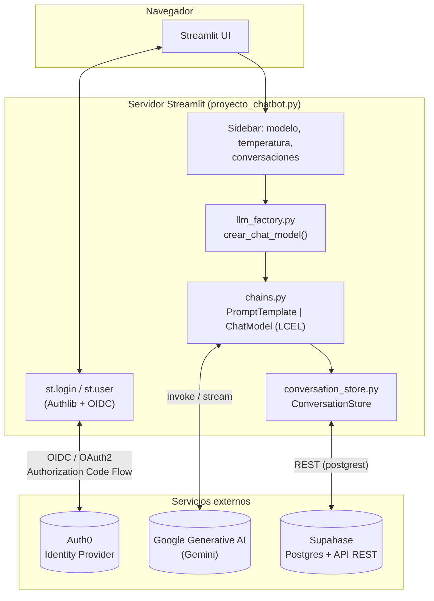
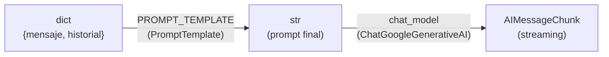
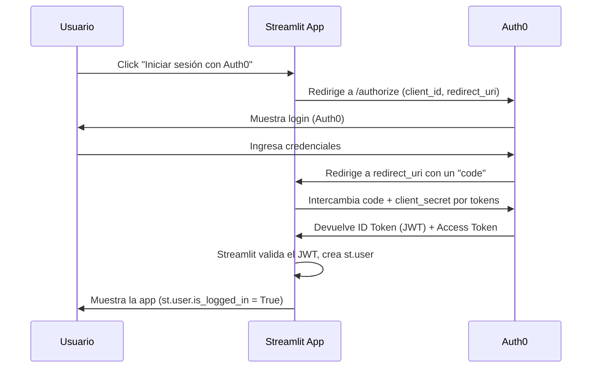
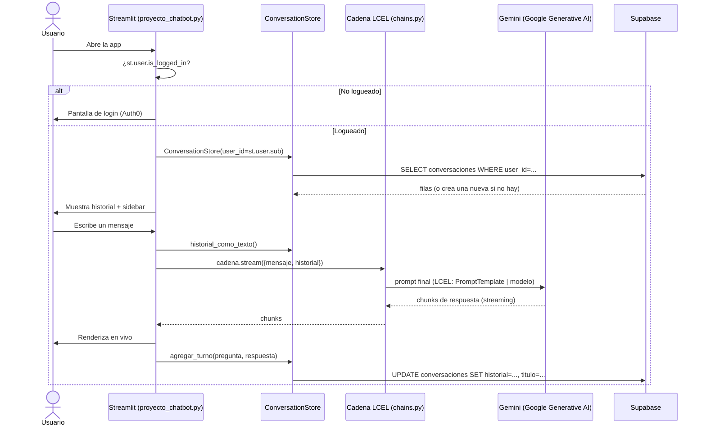

# ChatBot Pro 🤖

Un chatbot conversacional construido para **aprender LangChain en profundidad**: no es solo "conectar un LLM a una interfaz", sino un ejercicio deliberado de entender qué problema resuelve cada pieza — LangChain, Streamlit, Auth0 y Supabase — y por qué se conectan entre sí de esta manera y no de otra.

Este documento explica la teoría detrás de cada tecnología, las decisiones de diseño tomadas y las alternativas que se descartaron. Está pensado para alguien que quiere entender el *por qué*, no solo copiar el *cómo*.

> **Nota de portafolio**: este proyecto nació como práctica de la librería LangChain dentro de un curso de Análisis Funcional aplicado a IA. El foco no es la complejidad de producto sino la claridad conceptual de la arquitectura.

---

## Índice

1. [Qué hace la app](#qué-hace-la-app)
2. [Arquitectura general](#arquitectura-general)
3. [LangChain: la teoría detrás](#langchain-la-teoría-detrás)
4. [Streamlit como solución de interfaz](#streamlit-como-solución-de-interfaz)
5. [Auth0: autenticación delegada](#auth0-autenticación-delegada)
6. [Supabase: persistencia como servicio](#supabase-persistencia-como-servicio)
7. [Decisiones de diseño](#decisiones-de-diseño)
8. [Flujo completo, paso a paso](#flujo-completo-paso-a-paso)
9. [Estructura del proyecto](#estructura-del-proyecto)
10. [Cómo correrlo localmente](#cómo-correrlo-localmente)
11. [Seguridad y manejo de secretos](#seguridad-y-manejo-de-secretos)
12. [Limitaciones conocidas y próximos pasos](#limitaciones-conocidas-y-próximos-pasos)
13. [Glosario](#glosario)

---

## Qué hace la app

Un chat con:

- **Login obligatorio** vía Auth0 antes de ver cualquier contenido.
- **Múltiples conversaciones por usuario**, listadas en un sidebar, persistidas en Supabase (sobreviven a un reinicio del servidor).
- **Selección de modelo y temperatura** en tiempo real (Gemini 3.5/3.1/2.0 Flash-Lite, vía Google Generative AI).
- **Streaming** de la respuesta token a token.
- Título de conversación autogenerado a partir del primer mensaje (como ChatGPT/Claude).

Funcionalmente es simple a propósito: la complejidad que vale la pena mostrar en un portafolio no es "cuántas features tiene", sino **cuán bien separadas están las responsabilidades** para que cada pieza se pueda entender, testear y reemplazar de forma aislada.

---

## Arquitectura general



**Capas y responsabilidad única:**

| Módulo | Responsabilidad | Lo que NO sabe |
|---|---|---|
| `proyecto_chatbot.py` | Orquesta la UI y el flujo de la pantalla | Cómo se arma el prompt, cómo se persiste, qué proveedor de LLM hay detrás |
| `chatbot/chains.py` | Define el prompt y la cadena LCEL | Quién la llama, cómo se guarda el resultado |
| `chatbot/llm_factory.py` | Traduce un string de modelo en una instancia de LangChain | Qué es LCEL, qué hace la UI con el modelo |
| `chatbot/conversation_store.py` | Repositorio de conversaciones (alta, lectura, update) | Que detrás hay Supabase específicamente |
| `chatbot/supabase_client.py` | Abre y cachea la conexión a Supabase | Qué se guarda ahí ni con qué forma |
| `chatbot/config.py` | Lee configuración desde `.env` | Todo lo demás |

Esta tabla es, en el fondo, el **principio de responsabilidad única** aplicado literalmente: cada archivo puede leerse y entenderse sin tener que abrir los otros.

---

## LangChain: la teoría detrás

### El problema que resuelve

Llamar a un LLM "a mano" es trivial: mandás un string, recibís un string. El problema aparece cuando necesitás **componer** pasos — dar formato a un prompt con variables, mandarlo a un modelo, parsear la salida, encadenar eso con otro paso, cambiar de proveedor sin reescribir todo — y que ese pipeline sea:

- **Componible**: armar piezas grandes a partir de piezas chicas.
- **Intercambiable**: cambiar de proveedor (Google → OpenAI → Anthropic) sin reescribir la lógica de negocio.
- **Observable**: poder inspeccionar/loggear cada paso.
- **Ejecutable de varias formas**: síncrono, streaming, batch, async — sin duplicar código.

LangChain no es "un cliente de OpenAI mejorado". Es una **capa de abstracción** sobre LLMs, prompts y fuentes de datos, con una interfaz común (`Runnable`) que todo componente implementa.

### La interfaz `Runnable` y el operador `|`

Todo en LangChain moderno (prompts, modelos, parsers, retrievers) implementa la interfaz `Runnable`, que expone los mismos métodos sin importar qué hay detrás:

- `.invoke(input)` → ejecuta y devuelve el resultado completo.
- `.stream(input)` → devuelve un generador que va emitiendo chunks.
- `.batch([inputs])` → ejecuta varias entradas en paralelo.
- versiones `async` de las tres (`.ainvoke`, `.astream`, `.abatch`).

Como todos comparten esa interfaz, se pueden **encadenar con el operador `|`** (sobrecargado para significar "la salida de éste es la entrada del siguiente"). Esto es **LCEL — LangChain Expression Language**:

```python
# chatbot/chains.py
cadena = PROMPT_TEMPLATE | chat_model
```

Esa única línea define un pipeline: el diccionario `{"mensaje": ..., "historial": ...}` entra a `PROMPT_TEMPLATE`, que lo convierte en un string de prompt final; ese string sale y entra directo como input de `chat_model`. Todo el pipeline compuesto **también es un `Runnable`** — por eso `proyecto_chatbot.py` puede llamar `cadena.stream(...)` como si fuera un solo modelo, sin saber que en realidad son dos pasos encadenados.



Esto es el corazón conceptual de LangChain moderno: **composición declarativa sobre una interfaz uniforme**, en vez de imperativamente llamar `modelo.generate(prompt_armado_a_mano)`.

### `PromptTemplate`: separar la plantilla de los datos

```python
PROMPT_TEMPLATE = PromptTemplate(
    input_variables=["mensaje", "historial"],
    template=PERSONALIDAD + "...\n{historial}\n...\n{mensaje}",
)
```

Un `PromptTemplate` es, conceptualmente, un `str.format()` con contrato explícito: declara qué variables necesita (`input_variables`) y valida que estén presentes antes de generar el texto. Esto separa **la personalidad/instrucciones del bot** (algo versionable, testeable, iterable) **de los datos de cada turno** (mensaje del usuario, historial). Es la misma idea que separar plantilla HTML de los datos que la llenan.

### `BaseChatModel`: el modelo como pieza intercambiable

`ChatGoogleGenerativeAI` es una implementación concreta de `BaseChatModel`. Cualquier otro proveedor (`ChatOpenAI`, `ChatAnthropic`, `ChatOllama`...) implementa la misma interfaz. Esto es lo que hace posible que `chains.py` reciba `chat_model` como parámetro sin importar de qué clase es — ver la sección de [Decisiones de diseño](#decisiones-de-diseño) para el *factory* que aprovecha esto.

### Por qué no hay "memoria" de LangChain acá

Versiones más viejas de LangChain traían clases como `ConversationBufferMemory` para manejar el historial automáticamente. Este proyecto **decide no usarlas** y en cambio:

1. Guarda el historial como lista de `HumanMessage`/`AIMessage` (los tipos de mensaje nativos de LangChain) en `ConversationStore`.
2. Lo aplana a texto plano (`historial_como_texto()`) porque `PromptTemplate` espera strings, no objetos.
3. Se lo pasa como una variable más del prompt.

**Por qué**: control explícito y transparencia. El historial se ve, se testea y se persiste como datos simples (JSON), sin acoplarse a una abstracción de memoria que agrega una capa extra de comportamiento implícito. Es una elección consciente de simplicidad sobre "usar todo lo que ofrece el framework".

### Lo que este proyecto *no* cubre (y por qué es una decisión razonable)

- **Agentes y tools**: LangChain también permite que el modelo decida invocar herramientas (buscar en la web, ejecutar código, consultar una API). Acá no hace falta: es un chat simple, y agregar agentes sin necesidad real sería complejidad injustificada.
- **RAG (Retrieval-Augmented Generation)**: no hay una base de conocimiento propia que el bot consulte. El foco de este ejercicio era LCEL y la integración con servicios externos, no *retrieval*.
- **Output parsers estructurados**: la salida es texto libre en el chat; no hace falta parsear a JSON/Pydantic.

Mencionar explícitamente lo que *no* se usó (y por qué) es tan parte del diseño como lo que sí se usó.

---

## Streamlit como solución de interfaz

### El modelo mental: script que se re-ejecuta

Streamlit no es un framework de UI event-driven tradicional (no hay callbacks persistentes tipo React). Cada interacción del usuario (click, submit, cambio de slider) **vuelve a correr todo el script de arriba a abajo**. Esto explica varias decisiones del código:

- `chat_model = crear_chat_model(...)` se recrea en **cada rerun**. Como se documenta en `llm_factory.py`, esto es intencional y barato: instanciar un `ChatGoogleGenerativeAI` no hace ninguna llamada de red, así que es la forma correcta de reflejar un cambio de slider/selectbox en la siguiente pregunta.
- `st.rerun()` se llama explícitamente después de crear una conversación nueva o cambiar el título, para forzar que el sidebar se refresque ya.
- `obtener_cliente_supabase()` usa `@st.cache_resource` — si no, cada rerun abriría una conexión nueva a Supabase, que es costoso y absurdo para un recurso que puede vivir todo el proceso.

### Por qué Streamlit y no Flask/FastAPI + un frontend JS

Para un proyecto enfocado en aprender LangChain, el objetivo no es reinventar una UI de chat desde cero. Streamlit da:

- Componentes de chat nativos (`st.chat_message`, `st.chat_input`) pensados específicamente para este caso de uso.
- Autenticación nativa desde 1.42 (`st.login`, `st.user`) con soporte directo para proveedores OIDC como Auth0 — sin escribir el flujo OAuth a mano.
- Un ciclo de desarrollo rapidísimo: todo el frontend es Python, sin build step, sin bundlers.

El costo es menos control fino sobre la UI y un modelo de estado menos flexible que uno event-driven — un trade-off aceptable para un prototipo/ejercicio educativo, no necesariamente para un producto de escala.

---

## Auth0: autenticación delegada

### El problema: no querés ser vos quien maneja contraseñas

Manejar autenticación propia implica guardar contraseñas (hasheadas, saladas, con rotación de algoritmos), manejar recuperación de cuenta, 2FA, verificación de email, protección contra fuerza bruta... Es una superficie de riesgo enorme para algo que **no es el problema que este proyecto busca resolver**. Auth0 es un **Identity Provider (IdP)**: delega toda esa responsabilidad a un servicio especializado.

### El protocolo: OpenID Connect (OIDC) sobre OAuth2

OAuth2 resuelve *autorización* (¿puede esta app acceder a este recurso en tu nombre?). OIDC es una capa encima que agrega *autenticación* (¿quién sos vos?), devolviendo un **ID Token** (JWT) con la identidad del usuario.

El flujo que usa esta app es el **Authorization Code Flow**:



Streamlit implementa esto con **Authlib** por debajo (de ahí la dependencia `Authlib` en `requirements.txt`) y lo expone con dos primitivas simples:

```python
st.login("auth0")     # dispara el flujo de arriba
st.user.is_logged_in  # True/False
st.user.sub            # identificador único y estable del usuario (el "subject" del JWT)
st.user.email, st.user.name, st.user.get("picture")
```

### Por qué `st.user.sub` y no el email como identificador

`sub` (*subject*) es el identificador único e inmutable que Auth0 asigna a cada usuario dentro del token. El email puede cambiar o, en teoría, no ser único entre proveedores de login social; `sub` sí lo es dentro de un mismo *issuer*. Por eso `ConversationStore(user_id=st.user.sub)` particiona los datos por `sub` y no por email — una decisión de diseño discreta pero importante para la integridad de los datos.

### Configuración: `server_metadata_url`

En `secrets.toml`, `server_metadata_url` apunta al *discovery document* de OIDC (`/.well-known/openid-configuration`). Ese único endpoint le dice a Streamlit/Authlib dónde están todos los demás endpoints de Auth0 (`/authorize`, `/token`, `/userinfo`, las claves públicas para validar el JWT, etc.), evitando tener que hardcodear cada URL a mano.

---

## Supabase: persistencia como servicio

### Qué es, en una frase

Supabase es **Postgres administrado** con una API REST autogenerada (vía [PostgREST](https://postgrest.org/)), más auth, storage y realtime — pero en este proyecto se usa exclusivamente como **base de datos relacional accedida por HTTP**, sin sus features de auth (eso ya lo cubre Auth0) ni realtime.

### Por qué persistir y no `st.session_state`

`st.session_state` vive en memoria del proceso de Streamlit: se pierde si el servidor se reinicia, y no es compartido entre distintas sesiones/dispositivos del mismo usuario. Guardar en Supabase resuelve ambos problemas: el historial sobrevive un redeploy y, en teoría, el mismo usuario podría loguearse desde otro dispositivo y ver sus conversaciones.

### El modelo de datos

```sql
create table conversaciones (
    id uuid primary key default gen_random_uuid(),
    user_id text not null,          -- st.user.sub de Auth0
    titulo text not null default 'Nueva conversación',
    historial jsonb not null default '[]'::jsonb,  -- [{"role": "...", "content": "..."}]
    created_at timestamptz not null default now(),
    updated_at timestamptz not null default now()
);
```

**Por qué `jsonb` para el historial y no una tabla `mensajes` normalizada**: el historial de una conversación siempre se lee y se escribe *entero* (nunca se necesita un mensaje individual por fuera de su conversación), así que normalizarlo en filas separadas solo agregaría joins sin ningún beneficio real en este caso de uso. `jsonb` en Postgres es indexable y consultable si hiciera falta más adelante, así que no es una renuncia a "hacerlo bien", es la forma normal de modelar un documento cuando se accede como documento.

### Row Level Security (RLS): por qué está pero no hace nada (todavía)

```sql
alter table conversaciones enable row level security;

create policy "usuarios ven solo sus conversaciones"
    on conversaciones for all
    using (auth.uid()::text = user_id)
    with check (auth.uid()::text = user_id);
```

Esta policy compara `user_id` contra `auth.uid()` — la identidad de un usuario autenticado *vía Supabase Auth*. Pero esta app usa Auth0, no Supabase Auth, y el backend (Streamlit) se conecta con la **service role key**, que **ignora RLS por diseño** (es la clave de administración). El filtrado real por usuario ocurre en `conversation_store.py`, en la query `.eq("user_id", self._user_id)`.

Entonces, ¿para qué está la policy? Es documentado explícitamente en el propio SQL como un "cinturón de seguridad extra": si en el futuro se expusiera esta tabla con una clave `anon` (por ejemplo, consultada directo desde un cliente JS sin pasar por el backend), la policy evitaría que un usuario lea filas de otro. Hoy es una salvaguarda latente, no activa — una decisión de **defensa en profundidad** documentada honestamente en vez de dejada como RLS "cosmético".

### `st.cache_resource` para el cliente

```python
@st.cache_resource
def obtener_cliente_supabase() -> Client:
    ...
```

Igual que con el modelo de LLM, pero al revés: acá **sí** queremos que sea singleton (una sola conexión por proceso), porque abrir cliente HTTP nuevo en cada rerun de Streamlit sería puro desperdicio sin ningún beneficio (a diferencia de `chat_model`, que necesita recrearse para reflejar cambios de UI).

---

## Decisiones de diseño

### 1. Factory Pattern para proveedores de LLM (`llm_factory.py`)

```python
MODELOS_DISPONIBLES = {"gemini-3.5-flash-lite": "google", ...}
_FABRICANTES = {"google": lambda model_name, temperature, api_key: ChatGoogleGenerativeAI(...)}
```

**Problema que resuelve**: el sidebar solo conoce *strings* (el modelo elegido en un `selectbox`), pero instanciar el modelo real requiere conocer la clase concreta de LangChain de cada proveedor. Si `proyecto_chatbot.py` llamara `ChatGoogleGenerativeAI(...)` directamente, sumar OpenAI mañana implicaría tocar el archivo de UI.

**Principio aplicado**: abierto/cerrado (*open/closed*) — agregar un proveedor nuevo es agregar dos entradas a un diccionario, sin tocar el sidebar ni `chains.py`. El propio archivo lo documenta con el ejemplo exacto de cómo se sumaría OpenAI.

### 2. Repository Pattern para conversaciones (`conversation_store.py`)

`ConversationStore` expone una API en términos de negocio (`.actual`, `.nueva()`, `.agregar_turno()`, `.listar()`) sin que el resto de la app sepa que detrás hay Supabase. Esto significa que **la UI nunca escribe SQL ni conoce la forma de la tabla** — si mañana se migrara a otra base, solo cambia este archivo (y `supabase_client.py`).

### 3. Separación explícita entre "cómo se arma el prompt" y "cómo se sirve" (`chains.py` vs `proyecto_chatbot.py`)

El prompt (la "personalidad" del bot) vive en un módulo aparte, versionable y — en teoría — testeable sin necesidad de levantar Streamlit. Es una separación pequeña pero deliberada entre *lógica de dominio* (qué le decimos al modelo) y *lógica de presentación* (cómo se muestra en pantalla).

### 4. Un único punto de lectura de configuración (`config.py`)

`cargar_google_api_key()` centraliza la lectura de `.env`. La razón documentada en el propio código: evitar repetir `dotenv_values()` en cada script y tener un solo lugar para cambiar, por ejemplo, el nombre de la variable de entorno.

### 5. Streaming como default, no como optimización opcional

```python
for chunk in cadena.stream({"mensaje": pregunta, "historial": historial_texto}):
    full_response += chunk.content
    response_placeholder.markdown(full_response + "▌")
```

Gracias a que `cadena` es un `Runnable` (ver LCEL), cambiar de `.invoke()` a `.stream()` no requiere ningún cambio estructural — es la misma cadena, otro método de la misma interfaz. Se usa `.stream()` porque la percepción de latencia de un chat mejora enormemente cuando el texto aparece progresivamente, aunque el tiempo total de generación sea el mismo.

---

## Flujo completo, paso a paso



---

## Estructura del proyecto

```
chatbot_app/
├── proyecto_chatbot.py       # Entry point: UI, login, sidebar, loop de chat
├── requirements.txt
├── supabase_schema.sql       # DDL de la tabla "conversaciones" + RLS
├── .env                      # GEMINI_API_KEY (NO subir al repo)
├── .streamlit/
│   ├── config.toml           # Tema visual
│   └── secrets.toml          # Credenciales de Auth0 y Supabase (NO subir al repo)
└── chatbot/
    ├── __init__.py
    ├── chains.py              # Prompt + cadena LCEL (prompt | modelo)
    ├── config.py               # Lectura de .env
    ├── llm_factory.py           # Factory de chat models por proveedor
    ├── conversation_store.py    # Repositorio de conversaciones (Supabase)
    └── supabase_client.py       # Cliente Supabase cacheado
```

---

## Cómo correrlo localmente

### 1. Requisitos previos

- Python 3.10+
- Una cuenta de [Google AI Studio](https://aistudio.google.com/) para obtener una API key de Gemini.
- Un proyecto de [Auth0](https://auth0.com/) (aplicación tipo *Regular Web Application*).
- Un proyecto de [Supabase](https://supabase.com/).

### 2. Instalar dependencias

```bash
pip install -r requirements.txt
```

### 3. Configurar variables de entorno

Crear `.env` en la raíz del proyecto:

```env
GEMINI_API_KEY=tu_api_key_de_google
```

### 4. Configurar `.streamlit/secrets.toml`

```toml
SUPABASE_URL = "https://tu-proyecto.supabase.co"
SUPABASE_KEY = "tu_service_role_key"

[auth]
redirect_uri = "http://localhost:8501/oauth2callback"
cookie_secret = "una_cadena_aleatoria_larga_y_secreta"

[auth.auth0]
client_id = "tu_client_id_de_auth0"
client_secret = "tu_client_secret_de_auth0"
server_metadata_url = "https://tu-dominio.auth0.com/.well-known/openid-configuration"
```

En el dashboard de Auth0, agregar `http://localhost:8501/oauth2callback` a las **Allowed Callback URLs** de la aplicación.

### 5. Crear la tabla en Supabase

Correr el contenido de `supabase_schema.sql` en el SQL Editor del proyecto Supabase.

### 6. Levantar la app

```bash
streamlit run proyecto_chatbot.py
```

---

## Seguridad y manejo de secretos

Este proyecto, tal como está en disco, tiene **credenciales reales en texto plano** en `.streamlit/secrets.toml` (clave de servicio de Supabase, client secret de Auth0, cookie secret) y en `.env` (API key de Gemini). Antes de publicar el repositorio:

1. **Agregar un `.gitignore`** que excluya al menos: `.env`, `.streamlit/secrets.toml`, `__pycache__/`, `.venv/`.
2. **Rotar todas las credenciales** que hayan estado en un commit o en un archivo compartido, aunque sea localmente — asumir que una clave que existió en texto plano puede estar comprometida.
3. Publicar `secrets.toml` y `.env` como **archivos de ejemplo** (`secrets.toml.example`, `.env.example`) con placeholders, no con valores reales, para que cualquiera que clone el repo sepa qué variables necesita.
4. Tener presente que la clave de Supabase usada acá es la **service role key**, que bypassea RLS por completo — es intencional (la usa el backend, no el navegador), pero nunca debería exponerse en un cliente.

---

## Limitaciones conocidas y próximos pasos

Documentar esto también es parte del ejercicio: mostrar que las decisiones fueron conscientes y que hay un camino de mejora identificado, no una lista de bugs sin ver.

- **Sin `.gitignore` / manejo de secretos para publicación** (ver sección anterior) — lo primero a resolver antes de subir a GitHub.
- **RLS latente pero no activa**: si se quisiera defensa en profundidad real, habría que sincronizar la identidad de Auth0 con `auth.uid()` de Supabase (por ejemplo, vía JWT custom claims), o directamente evaluar si vale la pena mantener la policy dado que hoy no se ejerce.
- **Sin tests automatizados**: la separación en módulos (`chains.py`, `llm_factory.py`, `conversation_store.py`) está pensada para ser testeable de forma aislada, pero todavía no hay tests escritos.
- **Un solo proveedor de LLM activo** (Google): el `llm_factory` está preparado para sumar otros, pero no hay una segunda implementación real que valide el diseño.
- **Sin manejo de rate limiting / cuota** más allá de capturar la excepción genérica al momento de invocar el modelo.
- **Sin RAG ni tools/agentes**: fuera de alcance deliberado para este ejercicio (ver [LangChain: la teoría detrás](#langchain-la-teoría-detrás)), pero sería el paso natural siguiente para profundizar en LangChain.

---

## Glosario

| Término | Definición breve |
|---|---|
| **LLM** | *Large Language Model*: modelo de lenguaje entrenado para predecir/generar texto (en este caso, Gemini). |
| **LCEL** | *LangChain Expression Language*: la sintaxis declarativa de LangChain para componer `Runnable`s con el operador `\|`. |
| **Runnable** | Interfaz común de LangChain (`.invoke`, `.stream`, `.batch`, ...) que implementan prompts, modelos, parsers, etc. |
| **Chain (cadena)** | Composición de uno o más `Runnable`s ejecutados en secuencia. |
| **Prompt Template** | Plantilla de texto con variables (`{mensaje}`, `{historial}`) que se completan antes de mandarse al modelo. |
| **Streaming** | Recibir la respuesta del modelo en fragmentos (*chunks*) a medida que se genera, en vez de esperar el texto completo. |
| **OAuth2** | Protocolo de *autorización*: permite que una app acceda a recursos en nombre de un usuario sin manejar su contraseña. |
| **OIDC (OpenID Connect)** | Capa de *autenticación* sobre OAuth2; agrega el concepto de identidad verificada (ID Token / JWT). |
| **IdP (Identity Provider)** | Servicio externo (Auth0, en este caso) que gestiona identidades y credenciales de usuarios. |
| **JWT** | *JSON Web Token*: token firmado que codifica claims (como la identidad del usuario) de forma verificable. |
| **`sub`** | *Subject*: identificador único e inmutable de un usuario dentro de un token OIDC/JWT. |
| **RLS (Row Level Security)** | Mecanismo de Postgres para restringir qué filas puede ver/modificar cada rol o usuario a nivel de base de datos. |
| **PostgREST** | Servicio que expone una base Postgres como API REST automáticamente; es lo que usa Supabase por debajo. |
| **Service role key** | Clave de administración de Supabase que bypassea RLS; debe usarse solo desde el backend, nunca en el cliente. |
| **`st.session_state`** | Estado en memoria de una sesión de Streamlit; se pierde al reiniciar el servidor. |
| **Rerun (Streamlit)** | Re-ejecución completa del script de la app ante cualquier interacción del usuario; es el modelo de ejecución de Streamlit. |

---

*Documentación generada como parte del ejercicio de aprendizaje de LangChain — Tema 1, Análisis Funcional aplicado a IA.*
